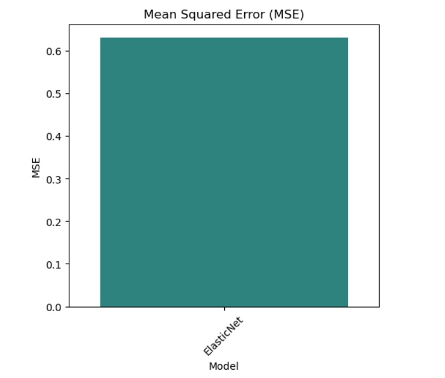
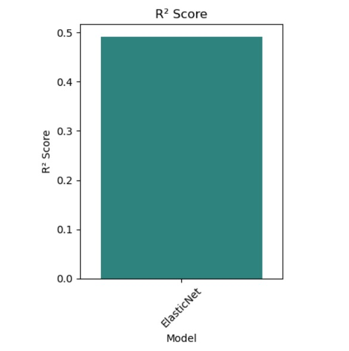

# BLENDED_LEARNING
# Implementation of Ridge, Lasso, and ElasticNet Regularization for Predicting Car Price

## AIM:
To implement Ridge, Lasso, and ElasticNet regularization models using polynomial features and pipelines to predict car price.

## Equipments Required:
1. Hardware – PCs
2. Anaconda – Python 3.7 Installation / Jupyter notebook

## Algorithm

1. Load and preprocess the dataset by encoding categorical variables, separating features and target (price), and standardizing the data.
2. Split the dataset into training and testing sets using train_test_split().
3. Create pipelines with Polynomial Features (degree 2) and apply Ridge, Lasso, and ElasticNet regression models, then train them.
4. Evaluate the models using MSE and R² score, store the results, and visualize them using bar plots.

## Program:
```
/*
Program to implement Ridge, Lasso, and ElasticNet regularization using pipelines.
Developed by: LOKESHWARAN G
RegisterNumber:  212225040210
*/
```
```
# Importing necessary libraries
import pandas as pd
import numpy as np
import matplotlib.pyplot as plt
import seaborn as sns
from sklearn.model_selection import train_test_split
from sklearn.linear_model import Ridge, Lasso, ElasticNet
from sklearn.preprocessing import PolynomialFeatures, StandardScaler
from sklearn.pipeline import Pipeline
from sklearn.metrics import mean_squared_error, r2_score
#load the dataset
data = pd.read_csv("encoded_car_data (1) (1).csv")
data.head()
# Data preprocessing
data = pd.get_dummies(data, drop_first=True)
#data = data.drop(['CarName', 'car_ID'], axis=1)


# Splitting the data into features and target variable
X = data.drop('price', axis=1)
y = data['price']
# Standardizing the features
scaler = StandardScaler()
X = scaler.fit_transform(X)
y = scaler.fit_transform(y.values.reshape(-1, 1))

# Splitting the dataset into training and testing sets 
X_train, X_test, y_train, y_test = train_test_split(X, y, test_size=0.2, random_state=42)
# Define the models and pipelines 
models = {"Ridge": Ridge(alpha=1.0),
    "Lasso": Lasso(alpha=1.0),
    "ElasticNet": ElasticNet(alpha=1.0, l1_ratio=0.5)
         }

# Dictionary to store results 
results = {}
# Train and evaluate each model 
for name, model in models.items():
    # Create a pipeline with polynomial features and the model 
    pipeline = Pipeline([('poly', PolynomialFeatures(degree=2)), ('regressor', model)])

    # Fit the model 
    pipeline.fit (X_train, y_train)

    # Make predictions
    predictions = pipeline.predict(X_test)

    # Calculate performance metrics
    mse = mean_squared_error(y_test, predictions) 
    r2 = r2_score(y_test, predictions)

    #Store resultsa
    results [name] = {'MSE': mse, 'R² Score': r2}
# Print results
print('Name: LOKESHWARAN.G')
print('Reg. No: 21222504210')
for model_name, metrics in results.items():
    print(f"{model_name} - Mean Squared Error:{metrics ['MSE']:.2f}, R² Score: {metrics['R² Score']:.2f}")
    
#Visualization of the results
#Convert results to DataFrame for easier plotting
results_df = pd.DataFrame(results).T
results_df.reset_index(inplace=True)
results_df.rename(columns={'index': 'Model'}, inplace=True)
#Set the figure size
plt.figure(figsize=(12, 5))

# Bar plot for MSE
plt.subplot(1, 2, 1)
sns.barplot(x='Model', y='MSE', data=results_df, palette='viridis')
plt.title('Mean Squared Error (MSE)')
plt.ylabel('MSE')
plt.xticks(rotation=45)

# Bar plot for R² Score
plt.subplot(1, 2, 2) 
sns.barplot(x='Model', y='R² Score', data=results_df, palette='viridis') 
plt.title('R² Score')
plt.ylabel('R² Score')
plt.xticks (rotation=45)
# Show the plots 
plt.tight_layout() 
plt.show()
```

## Output:





## Result:
Thus, Ridge, Lasso, and ElasticNet regularization models were implemented successfully to predict the car price and the model's performance was evaluated using R² score and Mean Squared Error.
